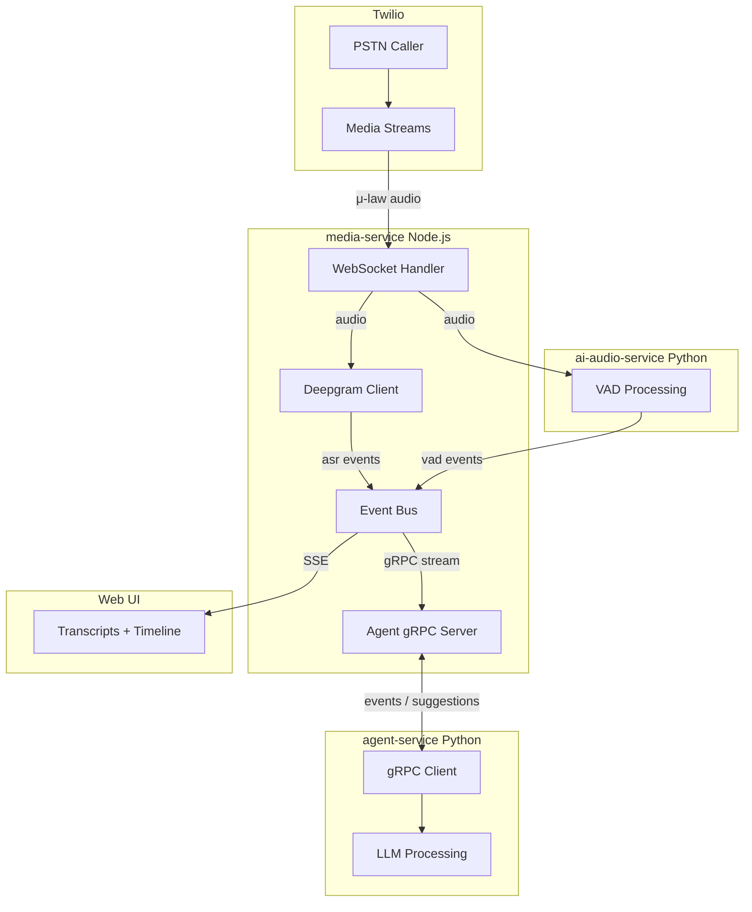

# Deepgram ASR + Agent 订阅集成方案

## 架构概览



---

## 核心设计：双 gRPC 流

### 现有: media-service → ai-audio-service

- media-service 作为 **客户端**
- 发送音频，接收 VAD 事件

### 新增: media-service → agent-service  

- media-service 作为 **服务端**
- Agent 作为 **客户端** 订阅事件
- Agent 通过同一流返回建议
```javascript
┌─────────────────┐         ┌─────────────────┐         ┌─────────────────┐
│ ai-audio-service│◄────────│  media-service  │◄────────│  agent-service  │
│    (Python)     │  gRPC   │    (Node.js)    │  gRPC   │    (Python)     │
│                 │ client  │                 │ server  │                 │
│   VAD/Audio AI  │────────►│   Orchestrator  │────────►│   LLM/Planning  │
└─────────────────┘  events └─────────────────┘  events └─────────────────┘
                                    │                          │
                                    │◄─────────────────────────┘
                                    │        suggestions
```


---

## Proto 定义

### 新增 `packages/proto/agent.proto`

```protobuf
syntax = "proto3";

package agent;

// media-service 作为服务端，Agent 作为客户端
service AgentBridge {
  // Agent 订阅会话事件，同时可以发送建议
  rpc Subscribe(stream AgentMessage) returns (stream SessionEvent);
}

// Agent → media-service
message AgentMessage {
  string session_id = 1;
  oneof message {
    SubscribeRequest subscribe = 10;
    AgentSuggestion suggestion = 11;
  }
}

message SubscribeRequest {
  string session_id = 1;
  repeated string event_types = 2; // ["vad.*", "asr.*", "call.*"]
}

message AgentSuggestion {
  string suggestion_id = 1;
  string plan = 2;
  repeated AgentAction actions = 3;
  float confidence = 4;
}

message AgentAction {
  string action_id = 1;
  oneof action {
    SayTTS say_tts = 10;
    SendDTMF send_dtmf = 11;
    WaitAction wait = 12;
    RequestUserTakeover request_takeover = 13;
    CopilotHint copilot_hint = 14;
  }
}

message SayTTS { string text = 1; }
message SendDTMF { string digits = 1; }
message WaitAction { string reason = 1; }
message RequestUserTakeover { string reason = 1; }
message CopilotHint { string text = 1; }

// media-service → Agent
message SessionEvent {
  string session_id = 1;
  uint64 timestamp_ms = 2;
  string event_type = 3; // "vad.remote.start", "asr.remote.final", etc.
  
  oneof event {
    VadEventData vad = 10;
    AsrEventData asr = 11;
    CallEventData call = 12;
  }
}

message VadEventData {
  string action = 1; // start/update/end
  float prob = 2;
  string track = 3;
  float music_prob = 4;
}

message AsrEventData {
  string text = 1;
  float confidence = 2;
  bool is_final = 3;
}

message CallEventData {
  string status = 1; // connecting/in_call/ending
  string call_sid = 2;
}
```

---

## 实现步骤

### Phase A: Deepgram ASR 集成

#### A1. 安装依赖

```bash
cd apps/media-service
pnpm add @deepgram/sdk
```


#### A2. 创建 Deepgram 模块

新建 `apps/media-service/src/asr/deepgram.js`:

- `createConnection(session)` - 创建 Deepgram WebSocket
- `sendAudio(session, buffer)` - 发送音频
- `closeConnection(session)` - 关闭连接
- 事件: `onPartial`, `onFinal`

#### A3. 集成到 media WS handler

修改 [apps/media-service/src/index.js](apps/media-service/src/index.js):

- 在 `start` 事件时创建 Deepgram 连接
- 在 `media` 事件时并行发送到 Deepgram 和 VAD
- 在 `stop` 事件时关闭连接

#### A4. 添加 ASR 事件

修改 [apps/media-service/src/events/normalize.js](apps/media-service/src/events/normalize.js):

- 添加 `asrEvent()` 生成器

---

### Phase B: Agent gRPC 服务端

#### B1. 添加 gRPC 服务端依赖

```bash
cd apps/media-service
pnpm add @grpc/grpc-js @grpc/proto-loader
```


#### B2. 创建 Agent gRPC 服务

新建 `apps/media-service/src/grpc/agentServer.js`:

```javascript
// 核心功能:
// - startAgentServer(port) - 启动 gRPC 服务
// - 维护 session → stream 映射
// - 接收 Agent 订阅请求
// - 向订阅的 Agent 推送事件
// - 接收并处理 Agent 建议
```


#### B3. 集成事件推送

修改事件总线，当事件发生时:

1. 推送到 Web UI (SSE) - 现有
2. 推送到已订阅的 Agent (gRPC) - 新增
```javascript
// apps/media-service/src/events/bus.js
function emitUiEvent(event) {
  // 现有: SSE 推送
  subscribers.forEach(cb => cb(event));
  
  // 新增: Agent gRPC 推送
  agentServer.pushEvent(event.payload?.sessionId, event);
}
```


---

### Phase C: Agent Service (Python)

#### C1. 创建服务目录结构

```javascript
apps/agent-service/
├── agent_service/
│   ├── __init__.py
│   ├── main.py           # 入口
│   ├── grpc_client.py    # gRPC 客户端
│   ├── event_handler.py  # 事件处理
│   └── llm/
│       ├── __init__.py
│       └── processor.py  # LLM 处理 (后续实现)
├── requirements.txt
└── README.md
```


#### C2. gRPC 客户端实现

```python
# agent_service/grpc_client.py

class AgentBridgeClient:
    def __init__(self, address):
        self.channel = grpc.insecure_channel(address)
        self.stub = agent_pb2_grpc.AgentBridgeStub(self.channel)
    
    def subscribe(self, session_id, event_types):
        """订阅会话事件，返回双向流"""
        def request_generator():
            # 发送订阅请求
            yield agent_pb2.AgentMessage(
                subscribe=agent_pb2.SubscribeRequest(
                    session_id=session_id,
                    event_types=event_types
                )
            )
            # 后续可发送建议
            while True:
                suggestion = self.suggestion_queue.get()
                if suggestion:
                    yield agent_pb2.AgentMessage(suggestion=suggestion)
        
        return self.stub.Subscribe(request_generator())
```

---

## 事件流示例

### 1. Agent 订阅会话

```javascript
Agent                    media-service
  │                           │
  │  Subscribe(session_id)    │
  │──────────────────────────>│
  │                           │
  │  SessionEvent (call.start)│
  │<──────────────────────────│
```


### 2. 通话中事件流

```javascript
Twilio    media-service    Deepgram    VAD    Agent
  │            │              │         │       │
  │  audio     │              │         │       │
  │───────────>│  audio       │         │       │
  │            │─────────────>│         │       │
  │            │  audio       │         │       │
  │            │─────────────────────>│       │
  │            │              │         │       │
  │            │  asr.partial │         │       │
  │            │<─────────────│         │       │
  │            │                        │       │
  │            │  SessionEvent(asr)     │       │
  │            │───────────────────────────────>│
  │            │                        │       │
  │            │         vad.start      │       │
  │            │<───────────────────────│       │
  │            │                        │       │
  │            │  SessionEvent(vad)     │       │
  │            │───────────────────────────────>│
```


### 3. Agent 返回建议

```javascript
Agent                    media-service
  │                           │
  │  AgentSuggestion          │
  │  (SEND_DTMF: "1")         │
  │──────────────────────────>│
  │                           │
  │                           │ (policy gate check)
  │                           │ (execute DTMF)
  │                           │
  │  SessionEvent             │
  │  (agent.action.executed)  │
  │<──────────────────────────│
```

---

## 配置清单

### 环境变量

```bash
# media-service
DEEPGRAM_API_KEY=xxx
ASR_ENABLED=true
ASR_LANGUAGE=en-US
AGENT_GRPC_PORT=50052

# agent-service
MEDIA_SERVICE_GRPC_URL=localhost:50052
OPENAI_API_KEY=xxx  # 后续 LLM 集成
```


### 端口分配

| 服务 | 端口 | 用途 ||------|------|------|| media-service HTTP | 4001 | REST API || media-service WS | 4001 | Media Streams + Events || ai-audio-service gRPC | 50051 | VAD 音频处理 || **media-service gRPC** | **50052** | **Agent 订阅 (新增)** |---

## 文件变更清单

### 新建文件

| 文件 | 用途 ||------|------|| `packages/proto/agent.proto` | Agent 通信协议定义 || `apps/media-service/src/asr/deepgram.js` | Deepgram ASR 客户端 || `apps/media-service/src/grpc/agentServer.js` | Agent gRPC 服务端 || `apps/agent-service/` | Agent Service 完整目录 |

### 修改文件

| 文件 | 变更 ||------|------|| `apps/media-service/package.json` | 添加依赖 || `apps/media-service/src/config/env.js` | 添加配置 || `apps/media-service/src/index.js` | 集成 Deepgram + 启动 Agent gRPC || `apps/media-service/src/events/bus.js` | 添加 Agent 推送 || `apps/media-service/src/events/normalize.js` | 添加 ASR 事件 || `apps/web/src/app/page.tsx` | 添加转写 UI |---

## 验收标准

### Deepgram ASR

1. ✅ 通话开始后 Deepgram 连接建立
2. ✅ 实时 partial 转写显示在 UI
3. ✅ final 转写正确分段

### Agent 订阅

4. ✅ Agent 能成功连接 gRPC 服务
5. ✅ Agent 收到 VAD 事件
6. ✅ Agent 收到 ASR 事件
7. ✅ Agent 建议被 media-service 接收