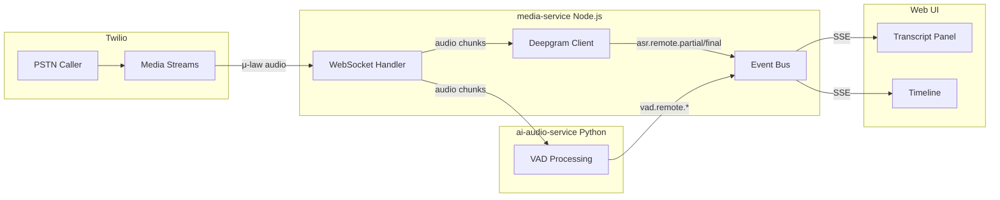

# Deepgram ASR 实时流式集成方案

## 架构概览




## 数据流设计

### 音频路径 (并行处理)

```javascript
Twilio Media Streams (μ-law 8kHz)
         │
         ▼
    media-service WS handler
         │
    ┌────┴────┐
    │         │
    ▼         ▼
Deepgram   Python VAD
(ASR)      (语音检测)
    │         │
    ▼         ▼
asr.remote.*  vad.remote.*
         │
         ▼
      Event Bus → Web UI
```


### Deepgram 连接管理

每个通话会话维护一个 Deepgram WebSocket 连接：

```javascript
// Session 结构扩展
{
  sessionId,
  callSid,
  streamSid,
  // 新增
  deepgramConnection: WebSocket | null,
  asrEnabled: boolean
}
```

---

## 实现步骤

### 1. 安装依赖

```bash
cd apps/media-service
pnpm add @deepgram/sdk
```


### 2. 环境变量配置

在 [apps/media-service/src/config/env.js](apps/media-service/src/config/env.js) 添加：

```javascript
DEEPGRAM_API_KEY    // Deepgram API Key
ASR_ENABLED         // 是否启用 ASR (default: true)
ASR_LANGUAGE        // 语言代码 (default: en-US)
```


### 3. 创建 Deepgram 客户端模块

新建 `apps/media-service/src/asr/deepgram.js`:

```javascript
// 核心功能:
// - createDeepgramConnection(session) - 创建 WebSocket 连接
// - sendAudio(session, mulawBuffer) - 发送音频数据
// - closeConnection(session) - 关闭连接

// Deepgram 配置:
// - model: nova-2 (最新模型)
// - language: en-US
// - encoding: mulaw (直接发送 Twilio 格式)
// - sample_rate: 8000
// - channels: 1
// - interim_results: true (实时 partial)
// - punctuate: true
// - endpointing: 300 (ms)
```


### 4. 修改 media WS handler

在 [apps/media-service/src/index.js](apps/media-service/src/index.js) 中：

```javascript
// 在 message.event === "start" 时:
// 1. 创建 Deepgram 连接
// 2. 设置转写事件处理

// 在 message.event === "media" 时:
// 1. 继续发送到 Python VAD (保持现有逻辑)
// 2. 同时发送到 Deepgram (新增)

// 在 message.event === "stop" 时:
// 1. 关闭 Deepgram 连接
// 2. 清理资源
```


### 5. 扩展事件规范化

在 [apps/media-service/src/events/normalize.js](apps/media-service/src/events/normalize.js) 添加：

```javascript
// 新增 ASR 事件生成器
function asrEvent({ ts, source, type, text, confidence, isFinal }) {
  return {
    id: `asr-${Date.now()}`,
    ts,
    category: 'ASR',
    level: 'INFO',
    payload: {
      event: `asr.${source}.${type}`, // asr.remote.partial / asr.remote.final
      text,
      confidence,
      isFinal
    }
  };
}
```


### 6. Web UI 更新

在 [apps/web/src/app/page.tsx](apps/web/src/app/page.tsx) 添加：

```typescript
// 新增状态
const [transcripts, setTranscripts] = useState<{
  remotePartial: string;
  remoteFinal: string[];
}>({ remotePartial: '', remoteFinal: [] });

// 处理 ASR 事件
if (event.category === 'ASR') {
  const text = event.payload?.text;
  const isFinal = event.payload?.isFinal;
  // 更新转写状态
}
```

---

## Deepgram 配置详情

### 推荐参数

| 参数 | 值 | 说明 ||------|-----|------|| model | nova-2 | 最新最准确的模型 || language | en-US | 可配置 || encoding | mulaw | 匹配 Twilio 格式 || sample_rate | 8000 | Twilio 默认采样率 || channels | 1 | 单声道 || interim_results | true | 启用实时 partial || punctuate | true | 自动标点 || smart_format | true | 智能格式化 || endpointing | 300 | 300ms 静音后结束句子 |

### WebSocket URL 格式

```javascript
wss://api.deepgram.com/v1/listen
  ?model=nova-2
  &language=en-US
  &encoding=mulaw
  &sample_rate=8000
  &channels=1
  &interim_results=true
  &punctuate=true
```

---

## 事件输出示例

### Partial (实时)

```json
{
  "id": "asr-1706123456789",
  "ts": 5230,
  "category": "ASR",
  "level": "INFO",
  "payload": {
    "event": "asr.remote.partial",
    "text": "hello I'm calling about my",
    "confidence": 0.92,
    "isFinal": false
  }
}
```


### Final (确定)

```json
{
  "id": "asr-1706123456999",
  "ts": 5890,
  "category": "ASR",
  "level": "INFO",
  "payload": {
    "event": "asr.remote.final",
    "text": "Hello, I'm calling about my prescription.",
    "confidence": 0.97,
    "isFinal": true
  }
}
```

---

## 文件变更清单

### 新建文件

| 文件 | 用途 ||------|------|| `apps/media-service/src/asr/deepgram.js` | Deepgram 客户端封装 |

### 修改文件

| 文件 | 变更 ||------|------|| `apps/media-service/src/config/env.js` | 添加 Deepgram 配置 || `apps/media-service/src/index.js` | 集成 Deepgram 到 media WS handler || `apps/media-service/src/events/normalize.js` | 添加 ASR 事件规范化 || `apps/media-service/src/sessions/sessionStore.js` | 扩展 session 结构 || `apps/media-service/package.json` | 添加 @deepgram/sdk 依赖 || `apps/web/src/app/page.tsx` | 添加转写显示 UI |---

## 验收标准

1. ✅ PSTN 通话开始后，Deepgram 连接自动建立
2. ✅ 对方说话时，UI 实时显示 partial 转写 (斜体)
3. ✅ 对方停顿后，UI 显示 final 转写 (正常样式)
4. ✅ 通话结束后，Deepgram 连接正确关闭
5. ✅ Timeline 记录所有 ASR 事件

---

## 后续扩展

- **本地 ASR**: 用户麦克风转写 (需要额外的音频流)