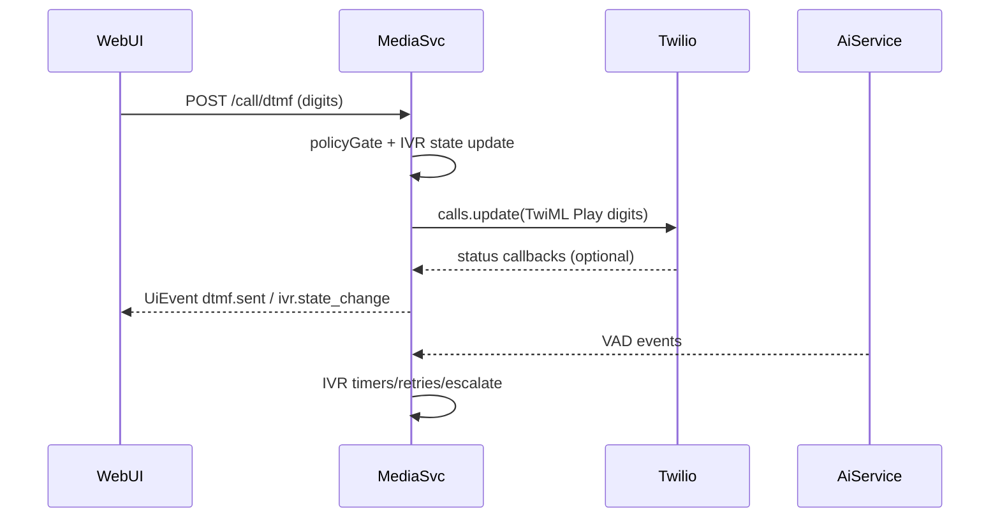

# DTMF 导航计划

## 目标

在不实现代码的前提下，制定 DTMF IVR 导航的详细计划：Node 在策略门控下发送按键，实时 IVR 控制器负责提示音时机/重试/升级，Web UI 提供按键盘与状态/事件展示。

## 现有结构（上下文）

- media-service 通话控制：[`apps/media-service/src/twilio/callControl.js`](apps/media-service/src/twilio/callControl.js)
- media-service 接口/事件：[`apps/media-service/src/index.js`](apps/media-service/src/index.js)
- 会话管理：[`apps/media-service/src/sessions/sessionStore.js`](apps/media-service/src/sessions/sessionStore.js)
- 事件标准化：[`apps/media-service/src/events/normalize.js`](apps/media-service/src/events/normalize.js)
- Web UI：[`apps/web/src/app/page.tsx`](apps/web/src/app/page.tsx)

## 计划

1. **定义策略门控 + DTMF 校验**

   - 在会话中新增 IVR 阶段字段（`IVR`, `HUMAN`, `COPILOT`），位置：[`apps/media-service/src/sessions/sessionStore.js`](apps/media-service/src/sessions/sessionStore.js)。
   - 统一校验：仅数字、最大长度、冷却时间；在 media-service 中提供 `canSendDtmf(session)`。
   - 在事件负载中新增 `DTMF` 与 `IVR` 事件类型，位置：[`apps/media-service/src/events/normalize.js`](apps/media-service/src/events/normalize.js)。

2. **在 media-service 增加 DTMF 发送路径**

   - 在 [`apps/media-service/src/twilio/callControl.js`](apps/media-service/src/twilio/callControl.js) 实现 `sendDtmf({ client, callSid, digits })`，使用 Twilio REST `calls.update()` 和 `<Play digits>`。
   - 在 [`apps/media-service/src/index.js`](apps/media-service/src/index.js) 增加 `POST /call/dtmf`：
     - 通过 `sessionId`/`callSid` 定位会话。
     - 校验 digits 并执行策略门控。
     - 发送 DTMF，并发出 `dtmf.sent`/`dtmf.blocked`/`dtmf.failed` 事件。

3. **创建仅实时的 IVR 控制器**

   - 新建模块 `apps/media-service/src/ivr/ivrController.js`，包含状态机：
     - 状态：`idle`、`waiting_for_prompt`、`prompt_playing`、`sending_digits`、`waiting_for_response`、`retrying`、`escalated`。
     - 定时器：提示音超时、响应超时、重试延迟。
     - 数据：`pendingDigits`、`attempts`、`lastPromptAt`、`lastVadEndAt`。
   - 在 [`apps/media-service/src/index.js`](apps/media-service/src/index.js) 里接入 VAD 事件，识别提示音边界并触发发送。
   - 增加 `POST /ivr/next-digits` 用于在下一次提示音结束后发送。

4. **Web UI 按键盘 + 状态展示**

   - 在 [`apps/web/src/app/page.tsx`](apps/web/src/app/page.tsx) 增加按键盘与输入框。
   - 按钮分别调用 `/call/dtmf`（立即发送）与 `/ivr/next-digits`（排队等待提示音）。
   - 通过 SSE `UiEvent` 展示 `IVR` 状态与最近一次 `DTMF` 结果。

5. **可观测性 + 手动检查清单**

   - 在 UI 时间线中展示 `DTMF` 与 `IVR` 事件。
   - 更新 [`apps/media-service/README.md`](apps/media-service/README.md) 的手动测试清单：开始通话 → 发送 digits → 验证 IVR 状态变化 → 验证重试/升级。

## Mermaid（高层流程）

