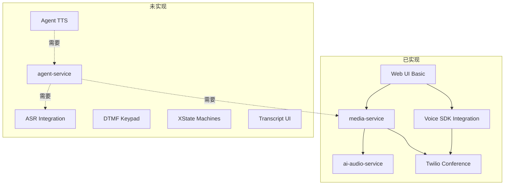

# CallBuddy Phase 1-3 功能差距分析

## 已完成功能 (Phase 1-2)

### Phase 1: 核心基础设施

| 组件 | 状态 | 实现内容 |

|------|------|----------|

| media-service (Node.js) | ✅ 完成 | Twilio REST/Media Streams, Session 管理, gRPC 客户端, SSE 事件推送 |

| ai-audio-service (Python) | ✅ 完成 | μ-law 解码, Silero VAD, MediaPipe 分类器 (语音+音乐检测) |

| Web UI 基础 | ✅ 完成 | Call/Hangup 按钮, VAD 状态显示, Timeline 事件日志 |

### Phase 2: Twilio Conference + Web 语音接入

| 功能 | 状态 | 实现位置 |

|------|------|----------|

| Conference 集成 | ✅ 完成 | [apps/media-service/src/twilio/twiml.js](apps/media-service/src/twilio/twiml.js) |

| Token 生成 | ✅ 完成 | [apps/media-service/src/index.js](apps/media-service/src/index.js) `/token` 端点 |

| Twilio Voice SDK | ✅ 完成 | [apps/web/src/lib/twilio/device.ts](apps/web/src/lib/twilio/device.ts) |

| Join/Leave/Mute | ✅ 完成 | [apps/web/src/app/page.tsx](apps/web/src/app/page.tsx) |

| 麦克风权限管理 | ✅ 完成 | [apps/web/src/lib/permissions/audio.ts](apps/web/src/lib/permissions/audio.ts) |

---

## 未完成功能 (主要差距)

### 1. Agent Service - 核心缺失

```
计划: apps/agent-service/ (Python)
状态: ❌ 完全未创建
```

根据 [docs/architecture.md](docs/architecture.md) 的设计:

- Agent 负责 "planning + suggestion"
- 应该接收结构化上下文 (transcripts, phase, constraints)
- 输出结构化建议 (SAY_TTS, SEND_DTMF, WAIT, REQUEST_USER_TAKEOVER)
- Node 负责执行，Agent 只建议

**影响**: 没有 Agent，整个 IVR 自动导航功能无法实现。

---

### 2. ASR (语音识别) - 未实现

```
计划: asr.remote.partial / asr.remote.final 事件
状态: ❌ 未实现
```

当前只有 VAD (语音活动检测)，没有实际的语音转文字。

**影响**:

- 无法显示实时转写
- Agent 无法理解 PSTN 对方说的内容
- Copilot 模式的字幕功能无法工作

---

### 3. DTMF 键盘 - 未实现

```
计划: UI → Node → Twilio DTMF
状态: ❌ 未实现
```

用户无法通过 UI 发送 DTMF 信号导航 IVR 菜单。

---

### 4. Agent TTS 输出 - 未实现

```
计划: Agent 通过 TTS 向 PSTN 说话
状态: ❌ 未实现
```

根据 Phase 2 计划，这是 "不在范围内" 的功能，但对完整产品是必需的。

---

### 5. XState v5 状态机 - 未实现

```
计划: apps/web/src/state/machines/ (callMachine, agentMachine, vadMachine)
状态: ❌ 目录为空
```

根据 [docs/web_gui_architecture.md](docs/web_gui_architecture.md) 的设计，应该使用 XState v5:

- callMachine: 通话状态 (disconnected/connecting/inCall/hold/ending)
- agentMachine: Agent 状态 (paused/listening/thinking/speaking)
- vadMachine: VAD 状态 (silent/speaking)

当前 UI 使用简单的 useState，没有状态机。

---

### 6. 完整 UI 布局 - 部分缺失

根据 [docs/web_gui_architecture.md](docs/web_gui_architecture.md):

| 组件 | 状态 | 说明 |

|------|------|------|

| Top Status Bar | ⚠️ 部分完成 | 有 VAD 状态，缺少 agentPhase, pipelineStatus |

| Control Panel | ⚠️ 部分完成 | 有 Call/Join/Mute，缺少 Agent 控制、设备选择器 |

| Live Transcripts | ❌ 未实现 | 无 Remote/Local/Agent 转写面板 |

| Command Bar | ❌ 未实现 | 无命令输入和 slash 命令 |

| Timeline | ✅ 完成 | 基本事件日志已实现 |

---

### 7. 其他未实现功能

| 功能 | 状态 | 优先级 |

|------|------|--------|

| 本地 VAD (用户麦克风) | ❌ | 中 |

| Barge-in 机制 | ❌ | 中 |

| 设备选择器 | ❌ | 低 |

| 通话录音 | ❌ | 低 |

| Copilot 模式 (实时翻译/提示) | ❌ | 高 |

| 身份验证检测 → 自动交接 | ❌ | 高 |

---

## 优先级建议 (Phase 3+)

### 高优先级 (核心产品功能)

1. **ASR 集成** - 没有语音识别，Agent 无法理解对话
2. **Agent Service 创建** - 核心 IVR 导航逻辑
3. **DTMF 键盘** - 手动 IVR 导航 fallback

### 中优先级 (增强功能)

4. **XState 状态机重构** - 更健壮的 UI 状态管理
5. **转写面板 UI** - 显示实时对话内容
6. **Agent TTS 输出** - AI 可以主动说话

### 低优先级 (可选功能)

7. 设备选择器
8. 本地 VAD
9. 通话录音
10. Barge-in 优化

---

## 架构完成度可视化



---

## 总结

- **Phase 1-2 核心目标已完成**: 基础通话功能、VAD、用户语音接入
- **主要差距**: Agent Service、ASR、DTMF 是实现产品核心价值的必需功能
- **建议下一步**: 优先实现 ASR 集成，然后创建 Agent Service 框架