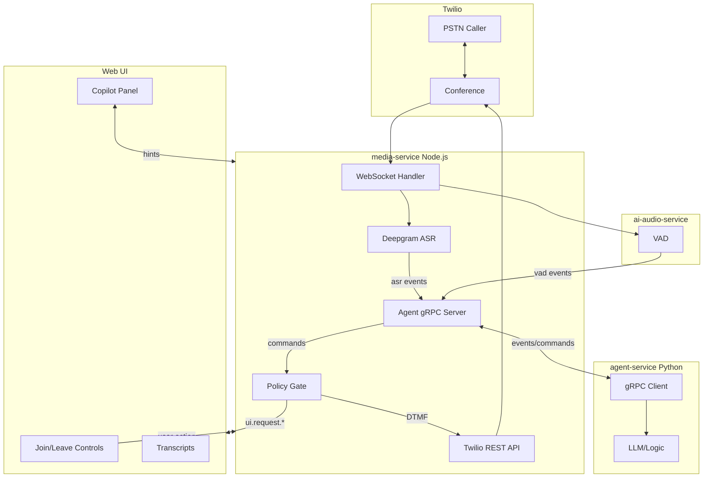

# 完整 Agent 集成方案

## 架构概览



---

## Agent 命令类型

### 完整命令列表

| 命令类型 | 目标 | 说明 | 示例 ||----------|------|------|------|| `SEND_DTMF` | Twilio | 发送 DTMF 按键 | `digits: "1"` || `SAY_TTS` | Twilio | AI 语音输出 (Phase 3+) | `text: "请稍等"` || `REQUEST_USER_JOIN` | Web UI | 请求用户加入通话 | `reason: "需要身份验证"` || `REQUEST_USER_LEAVE` | Web UI | 请求用户离开通话 | `reason: "IVR 导航中"` || `COPILOT_HINT` | Web UI | 显示提示文字 | `text: "对方在询问地址"` || `COPILOT_SUGGESTION` | Web UI | 显示建议回复 | `text: "请说: 123 Main St"` || `WAIT` | None | 等待 (不执行动作) | `reason: "等待对方说完"` |---

## Proto 定义更新

### `packages/proto/agent.proto`

```protobuf
syntax = "proto3";

package agent;

service AgentBridge {
  // Agent 订阅会话事件，同时发送命令
  rpc Subscribe(stream AgentMessage) returns (stream SessionEvent);
}

// ========== Agent → media-service ==========

message AgentMessage {
  string session_id = 1;
  oneof message {
    SubscribeRequest subscribe = 10;
    AgentCommand command = 11;
  }
}

message SubscribeRequest {
  string session_id = 1;
  repeated string event_types = 2;
}

message AgentCommand {
  string command_id = 1;
  string plan = 2;           // 当前计划说明
  float confidence = 3;
  
  oneof action {
    SendDTMF send_dtmf = 10;
    SayTTS say_tts = 11;
    RequestUserJoin request_user_join = 12;
    RequestUserLeave request_user_leave = 13;
    CopilotHint copilot_hint = 14;
    CopilotSuggestion copilot_suggestion = 15;
    WaitAction wait = 16;
  }
}

// 命令详情
message SendDTMF {
  string digits = 1;  // e.g. "1", "123#"
}

message SayTTS {
  string text = 1;
  string voice = 2;   // optional: alice, man, woman
}

message RequestUserJoin {
  string reason = 1;
  bool urgent = 2;    // 是否紧急 (UI 高亮显示)
}

message RequestUserLeave {
  string reason = 1;
}

message CopilotHint {
  string text = 1;
  string category = 2;  // info, warning, action
}

message CopilotSuggestion {
  string text = 1;          // 建议用户说的话
  string context = 2;       // 上下文说明
}

message WaitAction {
  string reason = 1;
  uint32 timeout_ms = 2;    // 可选超时
}

// ========== media-service → Agent ==========

message SessionEvent {
  string session_id = 1;
  uint64 timestamp_ms = 2;
  string event_type = 3;
  
  oneof event {
    VadEventData vad = 10;
    AsrEventData asr = 11;
    CallEventData call = 12;
    UserEventData user = 13;
    CommandResultData command_result = 14;
  }
}

message VadEventData {
  string action = 1;
  float prob = 2;
  string track = 3;
  float music_prob = 4;
}

message AsrEventData {
  string text = 1;
  float confidence = 2;
  bool is_final = 3;
}

message CallEventData {
  string status = 1;
  string call_sid = 2;
  string phase = 3;  // IVR, HUMAN, COPILOT
}

message UserEventData {
  string action = 1;  // joined, left, muted, unmuted
}

message CommandResultData {
  string command_id = 1;
  bool success = 2;
  string error = 3;
  string executed_action = 4;
}
```

---

## 命令执行流程

### 1. DTMF 发送

```javascript
Agent                media-service              Twilio
  │                       │                       │
  │  SendDTMF("1")        │                       │
  │──────────────────────>│                       │
  │                       │                       │
  │                       │  Policy Check         │
  │                       │  (phase == IVR?)      │
  │                       │                       │
  │                       │  calls.update()       │
  │                       │  <Play digits="1"/>   │
  │                       │──────────────────────>│
  │                       │                       │
  │  CommandResult(ok)    │                       │
  │<──────────────────────│                       │
```

**实现**: 使用 Twilio REST API `calls.update()` 发送 DTMF

```javascript
// apps/media-service/src/twilio/callControl.js
async function sendDTMF(callSid, digits) {
  await twilioClient.calls(callSid).update({
    twiml: `<Response><Play digits="${digits}"/></Response>`
  });
}
```

---

### 2. 请求用户 Join/Leave

```javascript
Agent                media-service              Web UI
  │                       │                       │
  │  RequestUserJoin      │                       │
  │  (reason: "验证")      │                       │
  │──────────────────────>│                       │
  │                       │                       │
  │                       │  SSE: ui.request.join │
  │                       │──────────────────────>│
  │                       │                       │
  │                       │                       │ (显示提示)
  │                       │                       │ (用户点击 Join)
  │                       │                       │
  │                       │  POST /call/join      │
  │                       │<──────────────────────│
  │                       │                       │
  │  UserEvent(joined)    │                       │
  │<──────────────────────│                       │
```

**Web UI 处理**:

```typescript
// apps/web/src/app/page.tsx

// 新增状态
const [agentRequest, setAgentRequest] = useState<{
  type: 'join' | 'leave' | null;
  reason: string;
  urgent: boolean;
} | null>(null);

// 处理 Agent 请求事件
if (event.payload?.event === 'ui.request.join') {
  setAgentRequest({
    type: 'join',
    reason: event.payload.reason,
    urgent: event.payload.urgent
  });
}
```

---

### 3. Copilot 文字输出

```javascript
Agent                media-service              Web UI
  │                       │                       │
  │  CopilotHint          │                       │
  │  ("对方在问地址")      │                       │
  │──────────────────────>│                       │
  │                       │                       │
  │                       │  SSE: copilot.hint    │
  │                       │──────────────────────>│
  │                       │                       │
  │                       │                       │ (显示提示)
  │                       │                       │
  │  CopilotSuggestion    │                       │
  │  ("说: 123 Main St")  │                       │
  │──────────────────────>│                       │
  │                       │                       │
  │                       │  SSE: copilot.suggest │
  │                       │──────────────────────>│
  │                       │                       │
  │                       │                       │ (显示建议)
```

**Web UI 显示**:

```typescript
// Copilot 面板状态
const [copilot, setCopilot] = useState<{
  hints: Array<{ text: string; category: string; ts: number }>;
  suggestion: { text: string; context: string } | null;
}>({ hints: [], suggestion: null });
```

---

## 事件规范化扩展

### `apps/media-service/src/events/normalize.js`

```javascript
// 新增事件生成器

// Agent 请求用户操作
function uiRequestEvent({ ts, action, reason, urgent }) {
  return {
    id: `ui-req-${Date.now()}`,
    ts,
    category: 'AGENT',
    level: 'INFO',
    payload: {
      event: `ui.request.${action}`, // ui.request.join, ui.request.leave
      reason,
      urgent
    }
  };
}

// Copilot 消息
function copilotEvent({ ts, type, text, category, context }) {
  return {
    id: `copilot-${Date.now()}`,
    ts,
    category: 'COPILOT',
    level: 'INFO',
    payload: {
      event: `copilot.${type}`, // copilot.hint, copilot.suggestion
      text,
      category,  // info, warning, action
      context
    }
  };
}

// 命令执行结果
function commandResultEvent({ ts, commandId, success, error, action }) {
  return {
    id: `cmd-result-${Date.now()}`,
    ts,
    category: 'AGENT',
    level: success ? 'INFO' : 'ERROR',
    payload: {
      event: 'agent.command.result',
      commandId,
      success,
      error,
      executedAction: action
    }
  };
}
```

---

## Policy Gate (安全边界)

### `apps/media-service/src/policy/gate.js`

```javascript
// 根据通话阶段和规则决定是否允许执行命令

const PHASE_RULES = {
  IVR: {
    allowed: ['SEND_DTMF', 'SAY_TTS', 'COPILOT_HINT', 'WAIT'],
    denied: ['REQUEST_USER_JOIN']  // IVR 阶段不需要用户
  },
  HUMAN: {
    allowed: ['REQUEST_USER_JOIN', 'COPILOT_HINT', 'COPILOT_SUGGESTION', 'WAIT'],
    denied: ['SEND_DTMF', 'SAY_TTS']  // 人工阶段禁止自动操作
  },
  COPILOT: {
    allowed: ['COPILOT_HINT', 'COPILOT_SUGGESTION', 'WAIT'],
    denied: ['SEND_DTMF', 'SAY_TTS', 'REQUEST_USER_JOIN']
  }
};

function checkCommand(session, command) {
  const phase = session.phase || 'IVR';
  const actionType = getActionType(command);
  
  if (PHASE_RULES[phase].denied.includes(actionType)) {
    return { allowed: false, reason: `${actionType} not allowed in ${phase} phase` };
  }
  
  return { allowed: true };
}
```

---

## Web UI 更新

### 新增组件

#### Copilot 面板

```typescript
// apps/web/src/components/CopilotPanel.tsx

function CopilotPanel({ hints, suggestion }) {
  return (
    <div className="copilot-panel">
      <h3>AI Assistant</h3>
      
      {/* 提示列表 */}
      <div className="hints">
        {hints.map(hint => (
          <div key={hint.ts} className={`hint ${hint.category}`}>
            {hint.text}
          </div>
        ))}
      </div>
      
      {/* 建议回复 */}
      {suggestion && (
        <div className="suggestion">
          <div className="context">{suggestion.context}</div>
          <div className="text">
            Say: "{suggestion.text}"
          </div>
        </div>
      )}
    </div>
  );
}
```


#### Agent 请求提示

```typescript
// 当 Agent 请求用户 Join 时显示
{agentRequest?.type === 'join' && (
  <div className={`agent-request ${agentRequest.urgent ? 'urgent' : ''}`}>
    <p>🤖 AI 请求你加入通话</p>
    <p className="reason">{agentRequest.reason}</p>
    <button onClick={handleJoinConference}>
      立即加入
    </button>
  </div>
)}
```

---

## 完整事件类型列表

### Agent 可订阅的事件

| 事件类型 | 来源 | 说明 ||----------|------|------|| `vad.remote.start/update/end` | VAD | 远程语音活动 || `asr.remote.partial` | Deepgram | 实时转写 || `asr.remote.final` | Deepgram | 最终转写 || `call.status` | Twilio | 通话状态变化 || `user.joined/left/muted` | Web UI | 用户操作 || `agent.command.result` | media-service | 命令执行结果 |

### Agent 可发送的命令

| 命令类型 | 目标 | 执行方式 ||----------|------|----------|| `SEND_DTMF` | Twilio | REST API || `SAY_TTS` | Twilio | TwiML (Phase 3) || `REQUEST_USER_JOIN` | Web UI | SSE 事件 || `REQUEST_USER_LEAVE` | Web UI | SSE 事件 || `COPILOT_HINT` | Web UI | SSE 事件 || `COPILOT_SUGGESTION` | Web UI | SSE 事件 |---

## 文件变更清单

### 新建文件

| 文件 | 用途 ||------|------|| `packages/proto/agent.proto` | Agent 通信协议 || `apps/media-service/src/asr/deepgram.js` | Deepgram ASR || `apps/media-service/src/grpc/agentServer.js` | Agent gRPC 服务 || `apps/media-service/src/policy/gate.js` | 命令安全检查 || `apps/agent-service/` | Agent 服务目录 || `apps/web/src/components/CopilotPanel.tsx` | Copilot UI |

### 修改文件

| 文件 | 变更 ||------|------|| `apps/media-service/src/index.js` | 集成所有新模块 || `apps/media-service/src/events/normalize.js` | 新事件类型 || `apps/media-service/src/twilio/callControl.js` | DTMF 发送 || `apps/web/src/app/page.tsx` | Copilot UI + Agent 请求 |---

## 验收标准

1. ✅ Agent 订阅成功收到 VAD/ASR 事件
2. ✅ Agent 发送 DTMF 命令，PSTN 收到按键
3. ✅ Agent 发送 RequestUserJoin，Web UI 显示提示
4. ✅ Agent 发送 CopilotHint，Web UI 显示提示文字