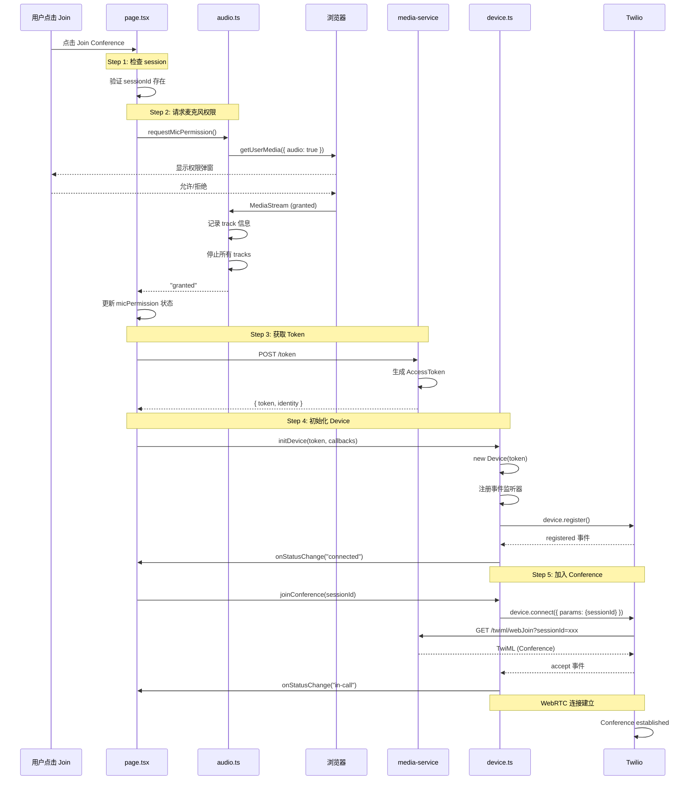

# Web 端麦克风处理逻辑与日志

本文档详细说明 Web 端点击 "Join Conference" 后的麦克风处理流程和日志打点。

---

## 完整流程图



---

## 详细步骤说明

### Step 1: 检查 Session

**位置:** `apps/web/src/app/page.tsx` → `handleJoinConference()`

**逻辑:**
```typescript
if (!callState.sessionId) {
  setError("No active call session");
  return;
}
```

**日志输出:**
```
[Web UI] ===== Join Conference Flow Start =====
[Web UI] Step 1: Checking session {
  sessionId: "sess_1737701234567_abc123",
  confName: "conf_sess_1737701234567_abc123",
  callStatus: "IN_CALL"
}
```

**失败场景:**
- 用户在 PSTN 通话建立前点击 Join
- sessionId 为 null 或 undefined

---

### Step 2: 请求麦克风权限

**位置:** `apps/web/src/lib/permissions/audio.ts` → `requestMicPermission()`

**逻辑:**
1. 检查 `navigator.mediaDevices.getUserMedia` 是否可用
2. 调用 `getUserMedia({ audio: true })`
3. 浏览器显示权限弹窗
4. 用户点击"允许"或"拒绝"
5. 如果允许，获取 `MediaStream` 对象
6. 记录所有音频 track 信息
7. **立即停止所有 tracks**（我们只需要权限，不需要持续占用麦克风）
8. 返回权限状态

**为什么立即停止 tracks？**
- 我们只是为了获取权限，确认浏览器可以访问麦克风
- 真正的音频流由 Twilio Voice SDK 管理
- 不停止会导致麦克风被两个流同时占用

**日志输出 (成功):**
```
[Web UI] Step 2: Requesting microphone permission...
[Audio Permissions] Requesting microphone access...
[Audio Permissions] Calling getUserMedia with audio:true
[Audio Permissions] Stream obtained {
  streamId: "stream-abc123",
  tracks: 1,
  audioTracks: 1
}
[Audio Permissions] Audio Track 0: {
  id: "track-xyz789",
  label: "MacBook Pro Microphone (Built-in)",
  enabled: true,
  muted: false,
  readyState: "live"
}
[Audio Permissions] Stopping track: MacBook Pro Microphone (Built-in)
[Audio Permissions] ✓ Permission GRANTED
[Web UI] Microphone permission result: granted
```

**日志输出 (拒绝):**
```
[Audio Permissions] ✗ Permission request failed: DOMException: Permission denied
[Audio Permissions] DOMException details: {
  name: "NotAllowedError",
  message: "Permission denied",
  code: 0
}
[Audio Permissions] User denied permission
[Web UI] Microphone permission result: denied
[Web UI] Microphone permission denied: denied
```

**可能的错误类型:**

| Error Name | 含义 | 日志前缀 |
|------------|------|---------|
| `NotAllowedError` | 用户拒绝权限 | User denied permission |
| `NotFoundError` | 找不到麦克风设备 | No microphone device found |
| `NotReadableError` | 麦克风被其他程序占用 | Microphone already in use |

---

### Step 3: 获取 Access Token

**位置:** `apps/web/src/app/page.tsx` → `handleJoinConference()`

**逻辑:**
```typescript
const tokenRes = await fetch(`${baseUrl}/token`, {
  method: "POST",
  headers: { "Content-Type": "application/json" },
  body: JSON.stringify({
    identity: `user_${Date.now()}`,
    sessionId: callState.sessionId,
  }),
});
```

**后端处理:** `apps/media-service/src/index.js` → `/token` endpoint

**日志输出:**
```
[Web UI] Step 3: Requesting token from backend {
  identity: "user_1737701234567",
  sessionId: "sess_1737701234567_abc123",
  endpoint: "http://localhost:4001/token"
}

// 后端日志
[media-service] POST /token
[media-service] Token generated for user_1737701234567

// 前端日志
[Web UI] Token response received {
  hasToken: true,
  hasError: false,
  identity: "user_1737701234567"
}
```

---

### Step 4: 初始化 Twilio Device

**位置:** `apps/web/src/lib/twilio/device.ts` → `initDevice()`

**逻辑:**
1. 解析 JWT token（用于调试）
2. 创建 `new Device(token, options)`
3. 注册所有事件监听器
4. 调用 `device.register()` 注册到 Twilio

**日志输出:**
```
[Web UI] Step 4: Initializing Twilio Device...
[Twilio Device] ===== Initializing Device =====
[Twilio Device] Token length: 523
[Twilio Device] Token identity: user_1737701234567
[Twilio Device] Token grants: {
  voice: {
    outgoing: { application_sid: "APxxxxxxxxxx" }
  }
}
[Twilio Device] Creating Device instance
[Twilio Device] Registering device...
[Web UI] Device status changed: connecting

// Twilio 注册成功后
[Twilio Device] ✓ Device registered successfully
[Twilio Device] ✓ Device registration complete
[Web UI] Device status changed: connected
```

**关键事件监听器:**
- `registered` - Device 成功注册到 Twilio
- `error` - Device 错误
- `incoming` - 收到来电（本场景不处理）
- `unregistered` - Device 注销

---

### Step 5: 加入 Conference

**位置:** `apps/web/src/lib/twilio/device.ts` → `joinConference()`

**逻辑:**
1. 调用 `device.connect({ params: { sessionId }})`
2. Twilio 请求后端 `/twiml/webJoin` 获取 TwiML
3. 后端返回 Conference TwiML
4. Twilio 建立 WebRTC 连接
5. 用户加入 Conference

**日志输出:**
```
[Web UI] Step 5: Joining conference {
  sessionId: "sess_1737701234567_abc123"
}
[Twilio Call] ===== Joining Conference =====
[Twilio Call] Session ID: sess_1737701234567_abc123
[Twilio Call] Device state: registered
[Twilio Call] Initiating connection...
[Web UI] Device status changed: calling

// Twilio 后端请求
[media-service] GET /twiml/webJoin
[media-service] Web join TwiML requested { sessionId: "sess_1737701234567_abc123" }

// 连接建立
[Twilio Call] ✓ Connection established {
  callSid: "CAxxxxxxxxxx",
  direction: "outbound-api"
}
[Twilio Call] Event handlers registered
[Twilio Call] Call ringing...
[Twilio Call] ✓ Call ACCEPTED
[Twilio Call] Call parameters: {
  CallSid: "CAxxxxxxxxxx",
  To: "client:conference",
  From: "+1234567890"
}
[Web UI] Device status changed: in-call
[Web UI] ===== Join Conference Flow Success =====
```

---

## 完整日志示例 (成功流程)

```
[Web UI] ===== Join Conference Flow Start =====
[Web UI] Step 1: Checking session { sessionId: "sess_...", confName: "conf_...", callStatus: "IN_CALL" }
[Web UI] Step 2: Requesting microphone permission...
[Audio Permissions] Requesting microphone access...
[Audio Permissions] Calling getUserMedia with audio:true
[Audio Permissions] Stream obtained { streamId: "...", tracks: 1, audioTracks: 1 }
[Audio Permissions] Audio Track 0: { id: "...", label: "Built-in Microphone", enabled: true, ... }
[Audio Permissions] Stopping track: Built-in Microphone
[Audio Permissions] ✓ Permission GRANTED
[Web UI] Microphone permission result: granted
[Web UI] Step 3: Requesting token from backend { identity: "user_...", sessionId: "sess_...", ... }
[media-service] POST /token
[media-service] Token generated for user_...
[Web UI] Token response received { hasToken: true, hasError: false, identity: "user_..." }
[Web UI] Step 4: Initializing Twilio Device...
[Twilio Device] ===== Initializing Device =====
[Twilio Device] Token length: 523
[Twilio Device] Token identity: user_...
[Twilio Device] Creating Device instance
[Twilio Device] Registering device...
[Web UI] Device status changed: connecting
[Twilio Device] ✓ Device registered successfully
[Twilio Device] ✓ Device registration complete
[Web UI] Device status changed: connected
[Web UI] Step 5: Joining conference { sessionId: "sess_..." }
[Twilio Call] ===== Joining Conference =====
[Twilio Call] Session ID: sess_...
[Twilio Call] Device state: registered
[Twilio Call] Initiating connection...
[Web UI] Device status changed: calling
[media-service] POST /twiml/webJoin
[media-service] Web join TwiML requested { sessionId: "sess_..." }
[Twilio Call] ✓ Connection established { callSid: "CA...", direction: "outbound-api" }
[Twilio Call] Event handlers registered
[Twilio Call] Call ringing...
[Twilio Call] ✓ Call ACCEPTED
[Web UI] Device status changed: in-call
[Web UI] ===== Join Conference Flow Success =====
```

---

## 常见错误排查

### 错误 1: 麦克风权限被拒绝

**日志特征:**
```
[Audio Permissions] ✗ Permission request failed: DOMException: Permission denied
[Audio Permissions] User denied permission
[Web UI] Microphone permission denied: denied
```

**原因:**
- 用户点击了"拒绝"
- 浏览器设置中麦克风被禁用

**解决:**
1. Chrome: 地址栏左侧 → 网站设置 → 麦克风 → 允许
2. Firefox: 地址栏左侧 → 权限 → 使用麦克风 → 允许

---

### 错误 2: Token 生成失败

**日志特征:**
```
[Web UI] Token response received { hasToken: false, hasError: true }
[Web UI] Token error: Token generation not configured
```

**原因:**
- 后端环境变量未配置（`TWILIO_API_KEY` 等）

**解决:**
参考 [`phase2-setup.md`](phase2-setup.md) 配置环境变量

---

### 错误 3: Device 注册失败

**日志特征:**
```
[Twilio Device] ✗ Registration failed: Error: ...
```

**可能原因:**
- Token 无效或过期
- 网络连接问题
- Twilio 服务不可用

---

### 错误 4: Conference 连接失败

**日志特征:**
```
[Twilio Call] ✗ Connection failed: Error: ...
```

**可能原因:**
- TwiML App URL 配置错误
- `/twiml/webJoin` 返回错误的 TwiML
- Conference 不存在（PSTN 通话已结束）

---

## 调试技巧

### 1. 打开浏览器 Console

按 `F12` 或 `Cmd+Option+I`，查看 Console 标签页。

### 2. 查看完整日志流

从 `[Web UI] ===== Join Conference Flow Start =====` 到 `[Web UI] ===== Join Conference Flow Success =====`。

### 3. 检查关键成功标记

- `[Audio Permissions] ✓ Permission GRANTED`
- `[Twilio Device] ✓ Device registered successfully`
- `[Twilio Call] ✓ Connection established`
- `[Twilio Call] ✓ Call ACCEPTED`

### 4. 检查 Device 状态变化

正常流程应该是：
```
disconnected → connecting → connected → calling → in-call
```

### 5. 验证音频 Track

```
[Audio Permissions] Audio Track 0: {
  label: "MacBook Pro Microphone (Built-in)",  // 应该显示真实设备名
  enabled: true,                               // 应该是 true
  readyState: "live"                           // 应该是 "live"
}
```

---

## 总结

麦克风处理逻辑核心要点：

1. **权限获取是一次性的** - 只用于检查是否有权限，立即停止 track
2. **真实麦克风流由 Twilio SDK 管理** - Voice SDK 内部处理 WebRTC
3. **Conference 不需要手动传输音频** - WebRTC 自动完成
4. **日志覆盖每个关键步骤** - 便于排查问题

通过完整的日志，可以精确定位问题发生在哪个步骤。
